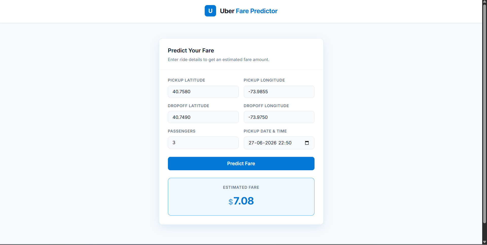

# Uber Fare Prediction (End-to-End ML + Flask API)

An end-to-end machine learning project that predicts Uber taxi fares based on pickup/dropoff coordinates, distance, time-based features, and passenger information.

The project follows a production-style ML workflow including feature engineering, preprocessing pipelines, model training, hyperparameter tuning, model persistence, and Flask API deployment for real-time predictions.

---

## Problem Statement

Taxi fare prediction is a regression problem where the goal is to estimate the fare amount based on trip characteristics such as:

- Pickup & dropoff coordinates
- Distance traveled
- Time of travel (hour, weekday, etc.)
- Passenger count

Accurate fare prediction helps improve pricing transparency and user experience in ride-hailing systems.

---

## Dataset

- **Dataset:** Uber Fare Prediction Dataset
- **Target Variable:** `fare_amount`
- **Features:**
  - `pickup_datetime`
  - `pickup_longitude`
  - `pickup_latitude`
  - `dropoff_longitude`
  - `dropoff_latitude`
  - `passenger_count`

---

## Project Workflow

```text
Data Collection
      ↓
Exploratory Data Analysis (EDA)
      ↓
Feature Engineering
      ↓
Data Cleaning (Outliers + Distance Calculation)
      ↓
Train / Test Split
      ↓
Preprocessing Pipeline (Encoding + Scaling)
      ↓
Model Training (Multiple Algorithms)
      ↓
Cross Validation (5-Fold CV)
      ↓
Hyperparameter Tuning (GridSearchCV)
      ↓
Model Evaluation
      ↓
Model Serialization (Joblib)
      ↓
Flask API Deployment
```

---

## Project Structure

```
uber-fare-prediction/
│
├── backend/
│   ├── app.py
│   ├── routes.py
│   ├── ml/
│   │   ├── train.py
│   │   ├── predict.py
│   │   ├── feature_engineering.py
│   │   ├── preprocessing.py
│   │   ├── model.pkl
│   │   └── threshold.pkl
│   │
│   ├── notebooks/
│   ├── eda.ipynb
│   │
│   └── data/
│       └── uber.csv
│
├── frontend/ (React app)
│
├── requirements.txt
├── .gitignore
└── README.md
```

---

## Tech Stack

- Python
- Pandas
- NumPy
- Scikit-learn
- XGBoost
- Flask
- Joblib
- React (Frontend)
- Matplotlib / Seaborn (EDA)

---

## Feature Engineering

Custom feature engineering was applied to improve model performance:

- Haversine distance calculation between coordinates
- Extracting time features:
  - `hour`
  - `weekday`
  - `month`
  - `peak hour flag`
- Removing invalid coordinates (0,0 values)
- Handling outliers in distance and fare

---

## Preprocessing Pipeline

A leakage-safe Scikit-learn pipeline was used:

- **Numerical Features** → `StandardScaler`
- **Categorical Features** → `OneHotEncoder`

Implemented using:

- `Pipeline`
- `ColumnTransformer`

---

## Models Tested

The following regression models were evaluated:

- Linear Regression
- Decision Tree Regressor
- Random Forest Regressor
- XGBoost Regressor

| Model             | MAE  | RMSE | R² Score |
| ----------------- | ---- | ---- | -------- |
| Linear Regression | 2.47 | 3.80 | 0.69     |
| Decision Tree     | 2.13 | 3.69 | 0.70     |
| Random Forest     | 1.68 | 2.87 | 0.82     |
| XGBoost           | 1.67 | 2.84 | 0.827    |

### Cross Validation Results (5-Fold)

- **MAE:** ~1.99
- **RMSE:** ~3.39
- **R² Score:** ~0.77

---

## Final Model

- **Model:** XGBoost Regressor
- **Selected due to:**
  - Best accuracy
  - Robustness
  - Good generalization

### Hyperparameter Tuning

GridSearchCV was used for optimization:

```python
param_grid = {
    "n_estimators": [100, 200, 300],
    "max_depth": [4, 6, 8],
    "learning_rate": [0.05, 0.1],
    "subsample": [0.8, 1.0],
    "colsample_bytree": [0.8, 1.0]
}
```

### Final Test Performance

- **R² Score:** 0.8582
- **MAE:** 1.46
- **MSE:** 7.19
- **RMSE:** 2.68

---

## Flask API

The trained model is served using Flask API.

### Endpoint

```
POST /predict
```

### Input JSON

```json
{
  "pickup_datetime": "2024-06-27 22:50:00 UTC",
  "pickup_longitude": -73.985428,
  "pickup_latitude": 40.748817,
  "dropoff_longitude": -73.977622,
  "dropoff_latitude": 40.761432,
  "passenger_count": 3
}
```

### Output

```json
{
  "predicted_fare": 7.75
}
```

## 🖼️ Project Screenshots

### 🔹 User Interface



---

## Key Learnings

- End-to-end ML pipeline design
- Feature engineering for geospatial data
- Avoiding data leakage in preprocessing
- Cross-validation and hyperparameter tuning
- Model serialization using Joblib
- Building REST API using Flask
- Handling real-time prediction pipelines

---

## Installation

```bash
git clone https://github.com/your-username/uber-fare-prediction.git
cd uber-fare-prediction
pip install -r requirements.txt
```

## Run Project

**Train model:**

```bash
python backend/ml/train.py
```

**Start Flask API:**

```bash
python backend/app.py
```

**Start Frontend:**

```bash
cd frontend
npm install
npm run dev
```

---

## License

This project is for educational and portfolio purposes only.
